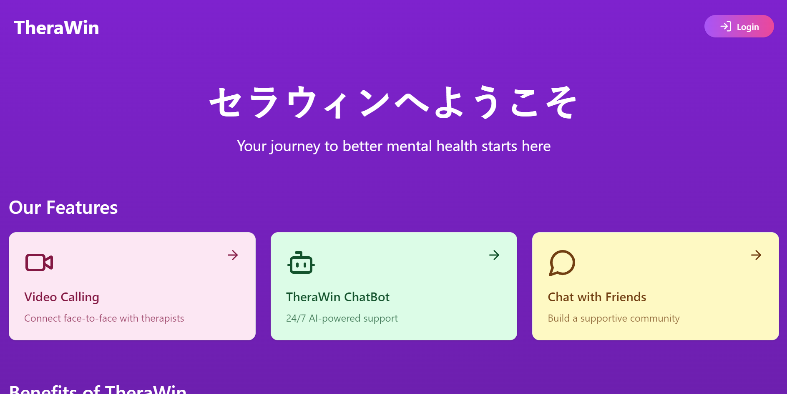
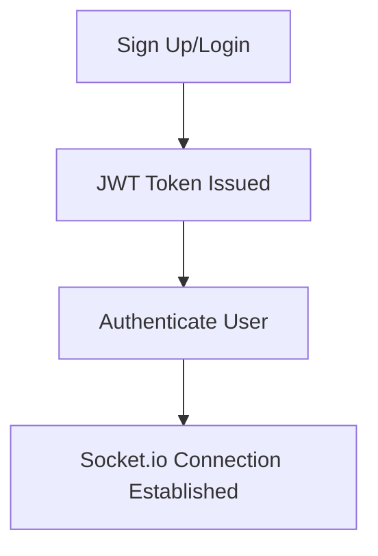
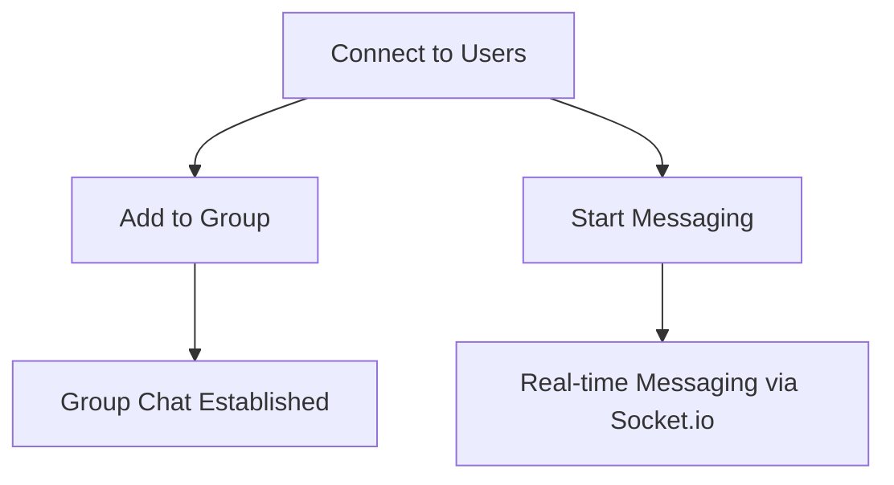
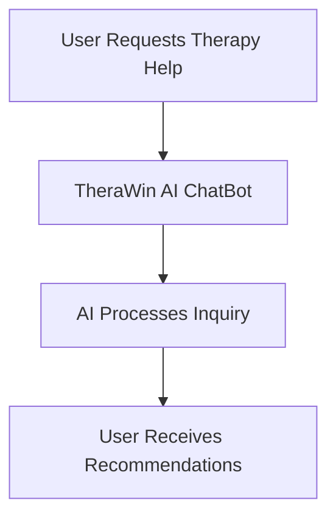

# 💬 **Real-time Chat Application**



**Live Demo**: [Explore the App Here](https://unrivaled-melba-047ef2.netlify.app/)  
⚠️ *Backend deployed on Render (free tier, may take a few seconds to load)* Hope you understand

---

## 👨‍💻 **Developer Info**
- **Name**: Pulkit Sinha
- **University**: Indian Institute of Technology (IIT) Dhanbad


## 🚀 **Overview**
Welcome to the **Real-time Chat Application**—an interactive chat platform that allows users to connect, message, create groups, video call, and even seek therapy assistance via **TheraWin AI ChatBot**. This app is perfect for individuals and groups who value seamless communication with advanced features.

---

## 🌟 **Key Features**

- **Real-time Messaging**: Chat instantly with friends, powered by **Socket.io**.
- **Group Chats**: Create and manage groups effortlessly.
- **TheraWin AI ChatBot**: Get therapy assistance directly from our AI-powered chatbot.
- **Video Calls**: Face-to-face conversations using the built-in **ZEGOCLOUD** video call feature.
- **Modern UI**: Experience elegant design and fluid animations with **Framer Motion** and **ShadCN UI**.
- **Secure**: Robust authentication with **JWT**.

---

## 🔧 **Tech Stack**

| **Technology** | **Usage** |
| -------------- | --------- |
| **Frontend**   | Next.js, Framer Motion, ShadCN UI |
| **Backend**    | Node.js, Express.js, Socket.io |
| **Database**   | MongoDB |
| **Auth**       | JWT (JSON Web Tokens) |
| **Deployment** | Frontend on Netlify, Backend on Render |

---

## 🛠 **Architecture & Workflows**

### 🔐 **User Authentication Flow**


- **Step 1**: Users log in or register.
- **Step 2**: JWT tokens secure the session.
- **Step 3**: Users are connected to the real-time server via **Socket.io**.

---

### 🔗 **Connection & Messaging Flow**


- **Step 1**: Connect to other users from the connection page.
- **Step 2**: Initiate private messages or add users to groups.
- **Step 3**: Real-time chats are powered by **Socket.io**.

---

### 🤖 **TheraWin ChatBot**


- **TheraWin ChatBot** provides AI-driven responses to therapy-related queries.

---

- Users can start video calls within the app using **ZEGOCLOUD** technology.

---

## Chat Backend

This repository contains the backend code for the chat application.

- **Repository Link:** [Chat Backend](https://github.com/anishiit/chat-backend)

## ZEOGOCLOUD

This repository contains the UI kits and group setup for ZEOGOCLOUD using Next.js.

- **Repository Link:** [ZEOGOCLOUD](https://github.com/anishiit/nextjs-zegocloud-uikits-groul)


Here’s a **System Design Document** for your **Real-time Chat Application Frontend**, including setup instructions, dependencies, and the rationale behind them.

---

# **System Design Document**

## 1. **Introduction**

This document outlines the design, technology stack, and setup for the **frontend** of the Real-time Chat Application. The frontend is built using modern web technologies like **Next.js**, **Framer Motion**, and **ShadCN UI**, and provides users with a smooth and intuitive interface for messaging, group chats, video calls, and AI-powered therapy assistance.

---

## 2. **System Architecture**

### 2.1 **Frontend Architecture**

The frontend is a **React-based** Single Page Application (SPA) powered by **Next.js**. It communicates with the backend via REST APIs and WebSocket connections, allowing real-time features like messaging and notifications. It also integrates with third-party services like **ZEGOCLOUD** for video calls and **TheraWin AI ChatBot** for therapy assistance.

### 2.2 **Component Diagram**
```
[ Client (Browser) ]
       |
       |     RESTful API (HTTP) + WebSocket (Socket.io)
       |
[ Frontend (Next.js) ] ------ [ Backend (Node.js + Express) ]
       |                      |
[ UI Components (Framer Motion, ShadCN UI) ]   [ MongoDB (Data Storage) ]
```

---

## 3. **Technology Stack**

### 3.1 **Next.js**
The primary framework used for building the frontend. Next.js is a **React-based framework** that supports server-side rendering and static site generation, enhancing both performance and SEO. It was chosen for its developer-friendly environment and scalability.

### 3.2 **Framer Motion**
Framer Motion is used to implement animations in the application. Its seamless integration with React provides a **smooth user experience** by enhancing interactions and transitions across the user interface.

### 3.3 **ShadCN UI**
ShadCN UI was chosen for building **modern, responsive UI components**. It offers pre-built yet highly customizable components, ensuring the frontend has a clean, professional look while maintaining flexibility in design.

### 3.4 **Socket.io**
Socket.io enables **real-time communication** between the client and the backend. It provides bi-directional communication, allowing instant message exchanges without needing page refreshes.

### 3.5 **ZEGOCLOUD**
ZEGOCLOUD is integrated into the application to support **video calls**. This service was chosen for its **reliable performance and ease of integration** with existing systems, making video calling accessible with minimal development effort.

### 3.6 **JWT (JSON Web Tokens)**
JWT is used for **authentication**. It ensures that users can securely log in and stay authenticated throughout their sessions. JWT was chosen for its ability to manage stateless authentication, reducing server overhead.

---

## 4. **Dependencies and Libraries**

- **Next.js**: React framework with support for server-side rendering.
- **Framer Motion**: A React animation library used for fluid transitions and animations.
- **ShadCN UI**: A customizable UI component library for building modern, responsive interfaces.
- **Socket.io**: For real-time communication via WebSocket.
- **ZEGOCLOUD**: For enabling video calls.
- **JWT (jsonwebtoken)**: For token-based user authentication.

### Installation of Dependencies:
Once the repository is cloned, you can install all dependencies by running:

```bash
npm install
```

This will install all required libraries from the `package.json` file.

---

## 5. **Workflows and Components**

### 5.1 **User Authentication Flow**
1. **Sign-up/Login**: Users register or log in through the frontend.
2. **JWT Token Issued**: Upon successful login, the backend issues a JWT token that is stored locally on the client.
3. **Authenticated Requests**: This token is sent with each request, allowing the backend to authenticate the user without requiring session storage.

### 5.2 **Real-Time Messaging Workflow**
1. **Client establishes WebSocket connection** with the backend using **Socket.io**.
2. **Real-time updates**: Messages are sent and received instantly via WebSocket, allowing for seamless communication.

### 5.3 **Video Calling Workflow**
1. Users initiate a video call, and the frontend **integrates with ZEGOCLOUD** to create a video session.
2. The session is established via an API call to ZEGOCLOUD, enabling users to communicate via video seamlessly.

---

## 6. **How to Set Up and Run the Frontend**

### 6.1 **Prerequisites**
- **Node.js**: Ensure that Node.js is installed. You can download it from [Node.js Official Site](https://nodejs.org/).
- **Netlify CLI** (optional): If you want to deploy locally using Netlify for easier management.

### 6.2 **Clone the Repository**
```bash
git clone https://github.com/sinha004/TalkSphere
```

### 6.3 **Install Dependencies**
Navigate to the cloned project directory:
```bash
cd chat-frontend
npm install
```

### 6.4 **Environment Setup**
Create a `.env.local` file in the root directory and configure the following variables:
```bash
NEXT_PUBLIC_BACKEND_URL=https://your-backend-url.com
NEXT_PUBLIC_ZEGOCLOUD_APP_ID=your-zegocloud-app-id
NEXT_PUBLIC_ZEGOCLOUD_APP_SECRET=your-zegocloud-app-secret
```

### 6.5 **Run the Frontend**
Start the development server:
```bash
npm run dev
```
The application will run on `http://localhost:3000`.

---

## 7. **Why These Technologies?**

- **Next.js** was chosen for its server-side rendering capabilities, improving the app's performance and SEO. It provides flexibility for creating both static and dynamic pages.
- **Framer Motion** is essential for creating smooth animations that improve the user experience, particularly in a modern chat application.
- **ShadCN UI** allows the creation of modern and responsive UI components, speeding up the design process while ensuring quality.
- **Socket.io** provides real-time communication essential for chat applications, enabling quick and efficient message delivery.
- **ZEGOCLOUD** simplifies the integration of video calls, providing high-quality video conferencing features with minimal effort.
- **JWT** ensures secure user authentication without the need for complex session management.

---

## 8. **Conclusion**

This system design outlines the architecture, technologies, and workflows involved in the frontend development of the real-time chat application. The use of modern libraries and frameworks ensures a high-performance, secure, and user-friendly chat experience. For any questions or contributions, feel free to submit issues or pull requests to the repository.

---
